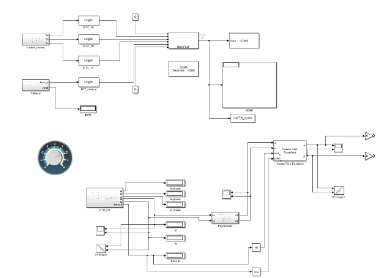
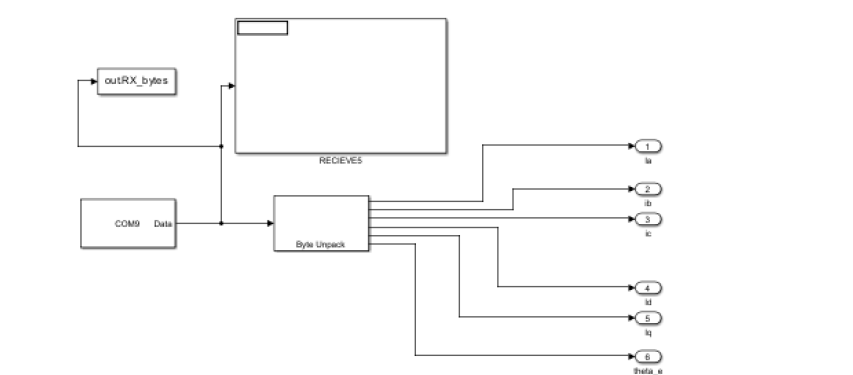
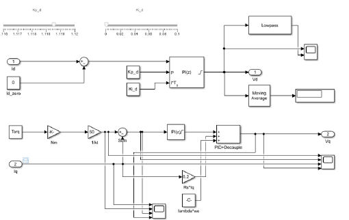
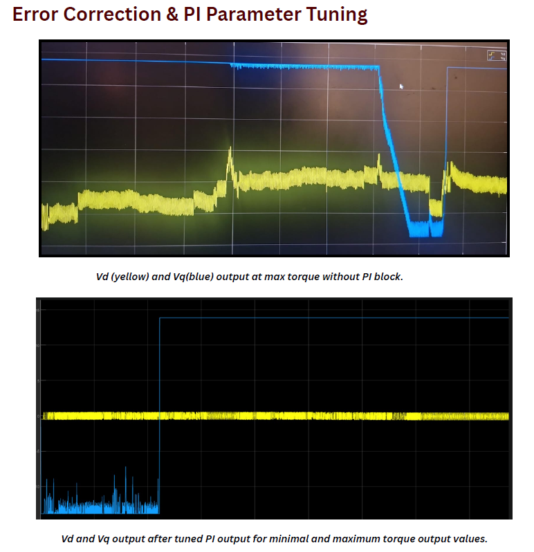
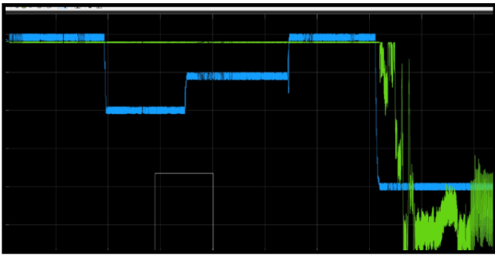
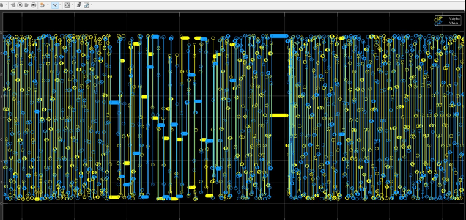
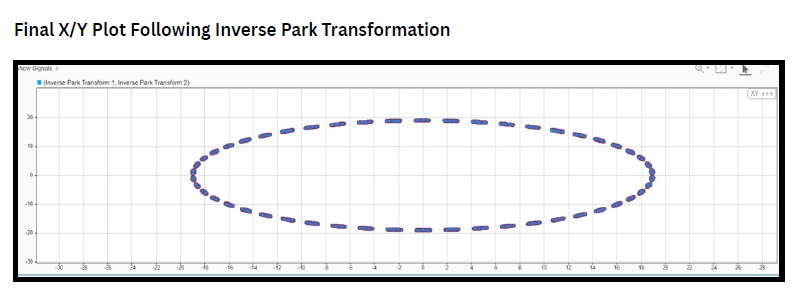

# HIL Validation of Field-Oriented Control

**Hardware-in-the-Loop (HIL) validation of a Field-Oriented Control (FOC) algorithm**, with the core FOC transforms running in real time on an **STM32G431** and the motor and control loop simulated in **MATLAB/Simulink**. It is an intermediate step toward a quiet, torque-controlled thruster drive for an **Autonomous Underwater Vehicle (AUV)**.

<p align="center">
  
</p>

---

## Why This Project

| Goal | How FOC helps |
|---|---|
| 🔇 **Low-noise propulsion** | Sinusoidal, current-controlled drive reduces torque ripple, vibration and acoustic noise, which matters for an AUV carrying acoustic sensors |
| 🎯 **Precise torque for docking** | Direct control of the torque-producing current *i<sub>q</sub>* gives predictable thrust at low speed and during docking |
| 🧪 **De-risked development** | HIL lets the embedded algorithm be tested, tuned and debugged before any power electronics or a real motor are connected |

The reference plant is the **Blue Robotics T100 thruster**, modelled at **500 RPM** with a torque range of **0–4 kg·cm**.

## Architecture

```
┌──────────────────────── MATLAB / Simulink ────────────────────────┐        ┌──────────── STM32G431 ────────────┐
│                                                                   │        │                                   │
│  Virtual motor ──► ia, ib, ic, θe ──► pack float32 frame ─────────┼─USB───►│  parse frame                      │
│                                                                   │  CDC   │     │                             │
│                                                                   │        │  Clarke  (abc → αβ)               │
│                                                                   │        │     │                             │
│  unpack ◄─────────────────────────────────────────────────────────┼◄───────│  Park    (αβ → dq, θe)            │
│    │                                                              │        │     │                             │
│  id, iq ──► current error ──► PI controllers ──► decoupling       │        │  send ia, ib, ic, id, iq, θe      │
│                                    │                              │        │  (every 10 ms)                    │
│                              Vd, Vq ──► inverse Park ──► Vα, Vβ   │        └───────────────────────────────────┘
└───────────────────────────────────────────────────────────────────┘
```

**Split of responsibilities**

| Simulink (plant + outer control) | STM32G431 (embedded FOC core) |
|---|---|
| Three-phase currents and electrical angle | Receives and validates binary frames |
| Motor speed and torque operating point | **Clarke transform:** *i<sub>α</sub>*, *i<sub>β</sub>* |
| PI current control and motor decoupling | **Park transform:** *i<sub>d</sub>*, *i<sub>q</sub>* |
| Inverse Park → *V<sub>α</sub>*, *V<sub>β</sub>* for SVPWM | Streams results back to Simulink |

Because the MCU sits inside the loop, the transforms that feed the PI controllers are executed by real embedded code on real hardware.

## Firmware

The STM32 project (`STM32/`) was generated with **STM32CubeMX** (STM32Cube FW_G4 V1.6.1) and builds in **STM32CubeIDE**. The MCU enumerates as a **USB CDC virtual COM port** using its native full-speed USB peripheral.

| File | Purpose |
|---|---|
| `Core/Src/main.c` | Main loop: runs Clarke → Park on each new frame and sends results every 10 ms |
| `Core/Src/foc_maths.c` | `clarke_transform()` and `Park()` |
| `Core/Src/hil_tx.c` | `HIL_SendFloats()`: packs floats into a framed binary packet |
| `USB_Device/App/usbd_cdc_if.c` | USB receive callback: finds, validates and decodes incoming frames |
| `G431_CDC.ioc` | CubeMX configuration |

### FOC maths on the MCU

```c
// Clarke (amplitude-invariant, assumes ia + ib + ic = 0)
i_alpha = ia;
i_beta  = (ib - ic) / sqrt(3);

// Park (rotating frame, electrical angle θ)
id =  i_alpha * cos(θ) + i_beta * sin(θ);
iq = -i_alpha * sin(θ) + i_beta * cos(θ);
```

### Communication protocol

All values are little-endian IEEE-754 `float32`, framed by a start byte `0xAA` and an end byte `0x55`.

**Simulink → STM32**: 18 bytes

| Byte | 0 | 1–4 | 5–8 | 9–12 | 13–16 | 17 |
|---|---|---|---|---|---|---|
| Field | `0xAA` | *i<sub>a</sub>* | *i<sub>b</sub>* | *i<sub>c</sub>* | *θ<sub>e</sub>* (rad) | `0x55` |

**STM32 → Simulink**: 26 bytes, sent every 10 ms

| Byte | 0 | 1–4 | 5–8 | 9–12 | 13–16 | 17–20 | 21–24 | 25 |
|---|---|---|---|---|---|---|---|---|
| Field | `0xAA` | *i<sub>a</sub>* | *i<sub>b</sub>* | *i<sub>c</sub>* | *i<sub>d</sub>* | *i<sub>q</sub>* | *θ<sub>e</sub>* | `0x55` |

Echoing the inputs lets Simulink confirm the link is intact and compare the embedded results against its own reference.

## Simulink Model

<p align="center">
  
  
</p>

- **Sender:** packs the phase currents and electrical angle into the 18-byte frame and writes it to the serial port.
- **Receiver:** reads the 26-byte frame and unpacks *i<sub>d</sub>* and *i<sub>q</sub>* for the control loop.

<p align="center">
  
</p>

- **Control:** d- and q-axis PI current controllers with motor-dependent decoupling produce *V<sub>d</sub>* and *V<sub>q</sub>*, which inverse Park turns into *V<sub>α</sub>* and *V<sub>β</sub>*.

## Results

<table>
<tr>
<td align="center"><br><sub><b>V<sub>d</sub> / V<sub>q</sub></b> response during PI tuning</sub></td>
<td align="center"><br><sub><b>i<sub>q</sub> error</b> and <b>V<sub>q</sub></b> response to torque demand</sub></td>
</tr>
<tr>
<td align="center"><br><sub><b>V<sub>α</sub> / V<sub>β</sub></b> stationary-frame voltages</sub></td>
<td align="center"><br><sub><b>V<sub>α</sub>–V<sub>β</sub> XY plot</b>: the rotating voltage vector</sub></td>
</tr>
</table>

**Validated so far**
- ✅ Real-time binary frame exchange between Simulink and the STM32 over USB CDC
- ✅ Embedded Clarke and Park transforms producing *i<sub>d</sub>* and *i<sub>q</sub>*
- ✅ Closed-loop PI current control with decoupling, tuned across the 0–4 kg·cm torque range
- ✅ Inverse Park *V<sub>α</sub>* / *V<sub>β</sub>* generating a clean rotating voltage vector, ready for SVPWM

## Getting Started

### Requirements

| Software | Hardware |
|---|---|
| MATLAB / Simulink **R2023b** (with serial I/O blocks) | STM32G431CBU6 board with a USB connector |
| STM32CubeIDE | ST-Link programmer |

### 1. Flash the firmware
1. Import `STM32/` into STM32CubeIDE (**File → Import → Existing Projects into Workspace**).
2. Build and flash via ST-Link.

### 2. Connect over USB
1. Plug the STM32's USB port into the PC. It enumerates as a virtual COM port.
2. Note the port number in **Device Manager** (e.g. `COM9`).

### 3. Run the model
1. Open `Simulink Model/HIL.slx` in MATLAB R2023b.
2. Set **the same COM port** in both the serial send and serial receive blocks. The model uses 115200 baud; with USB CDC the baud setting doesn't limit throughput.
3. Run the model and watch the scopes.

### What to observe
- **Tracking:** change the torque command across **0–4 kg·cm** and watch *i<sub>d</sub>* and *i<sub>q</sub>* respond.
- **PI performance:** the current error shows how well the controllers track the reference.
- **Controller effort:** *V<sub>d</sub>* and *V<sub>q</sub>* show how hard the controllers are working.
- **SVPWM input:** *V<sub>α</sub>* and *V<sub>β</sub>* (and their XY plot) are what the next SVPWM stage will consume.

## Repository Structure

```
HIL-FOC-VALIDATION/
├── README.md
├── Simulink Model/
│   └── HIL.slx                                   # HIL model (R2023b)
├── STM32/
│   ├── Core/                                     # Application + FOC maths
│   ├── USB_Device/                               # USB CDC stack + frame parser
│   ├── Drivers/, Middlewares/                    # ST HAL and USB middleware
│   └── G431_CDC.ioc                              # CubeMX configuration
├── Documentation/
│   ├── HIL_FOC_Validation_Report_AfraazKhan.pdf      # Project report
│   └── Mathematical_analysis_foc.html            # FOC maths: sine waves → SVPWM
└── Media/                                        # Model screenshots and result plots
```

📘 **Theory:** [`Mathematical_analysis_foc.html`](Documentation/Mathematical_analysis_foc.html) walks through the full maths: three-phase generation, Clarke, Park, PI control, decoupling, inverse Park, SVPWM sectors, timing and duty cycles.

📄 **Report:** [HIL validation report (PDF)](Documentation/HIL_FOC_Validation_Report_AfraazKhan.pdf)

## Roadmap

This HIL setup validates the control maths. Next steps move it onto real hardware:

- [ ] SVPWM generation on STM32 timers (dead time, centre-aligned PWM)
- [ ] Gate driver and three-phase inverter power stage
- [ ] Real current sensing and rotor-angle estimation
- [ ] Integration with the T100 thruster and live tuning
- [ ] Torque-control validation for docking manoeuvres
- [ ] Acoustic noise measurement and optimisation
